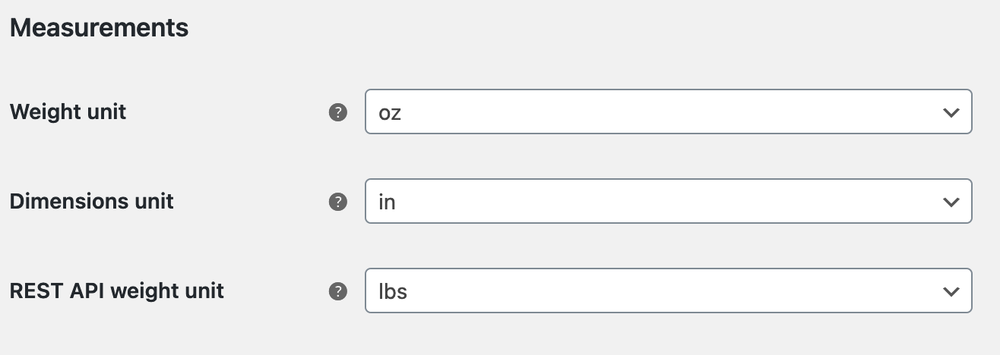

[](https://wordpress.org/plugins/bh-wc-rest-change-units) [](https://github.com/WordPress-Coding-Standards/WordPress-Coding-Standards) [](https://brianhenryie.github.io/bh-wc-rest-change-units/)

# REST Change Units

Use different product weight units in the REST API than elsewhere in your WooCommerce store.

Uses [PhpUnitsOfMeasure](https://github.com/PhpUnitsOfMeasure/php-units-of-measure) library for conversions.

## Why?

When importing orders to [DHL](https://dhlexpresscommerce.com/), the only configurable units on DHL's end were `g` / `kg` / `lbs`. Our store uses `oz` internally. 

## Use

Download latest release, upload to your WordPress/WooCommerce store. Configure:



Only one option is provided by the plugin, on the WooCommerce settings product page.

For more granular control, use the `pre_option_bh_wc_rest_change_units_weight_unit` filter:

```php
/**
 * Conditionally configure the units to return in the REST API.
 * 
 * @see get_option()
 * 
 * @param false|mixed $pre_option Return false to fetch the option value as normal.
 * @param string      $option     The option name: "bh_wc_rest_change_units_weight_unit".
 * @param mixed       $default    The default value as might be specified by get_option() second parameter.
 *
 * @return false|mixed|string|void
 */
$conditionally_change_rest_weight_unit = function ( $pre_option, $option, $default ) {

	// Check consumer key.
	if( 'ck_0123456789abcdef1234567890abcdef123abcd' === $_SERVER['PHP_AUTH_USER'] ) {
		return 'g';
	}

	// Check IP address.
	if( '127.0.0.1' === WC_Geolocation::get_ip_address() ) {
		return 'oz';
	}

	// Check user agent.
	if( 'PostmanRuntime/7.26.8' === $_SERVER['HTTP_USER_AGENT'] ) {
		return 'lbs';
	}

	// Do no conversion. TODO: infinite loop here.
	return get_option( 'woocommerce_weight_unit' );


	// Return whatever is configured in WooCommerce settings (i.e. return what is configured on the settings page as normal).
	return $pre_option;

};
add_filter( 'pre_option_bh_wc_rest_change_units_weight_unit', $conditionally_change_rest_weight_unit, 10, 3 );
```


## Notes

### Internal REST API calls.

It's not unheard of for WordPress plugins to use the REST API internally to query data, so this may result in unexpected behavioiur.

### Create/Update

This does not make any conversions when data is being _written_ to the REST API.

### Product Types

This is only tested with Simple products (although 'weight' is a field in the base WC_Product, so I expect it should work without issue).

### Gutenberg

Since Gutenberg uses the REST API, this will probably affect weights when displayed in blocks.

## Contributing

Clone this repo, open PhpStorm, then run `composer install` to install the dependencies.

```
git clone https://github.com/brianhenryie/bh-wc-rest-change-units.git;
open -a PhpStorm ./;
composer install;
```

For integration and acceptance tests, a local webserver must be running with `localhost:8080/bh-wc-rest-change-units/` pointing at the root of the repo. MySQL must also be running locally – with two databases set up with:

```
mysql_username="root"
mysql_password="secret"

# export PATH=${PATH}:/usr/local/mysql/bin

# Make .env available to bash.
export $(grep -v '^#' .env.testing | xargs)

# Create the databases.
mysql -u $mysql_username -p$mysql_password -e "CREATE USER '"$TEST_DB_USER"'@'%' IDENTIFIED WITH mysql_native_password BY '"$TEST_DB_PASSWORD"';";
mysql -u $mysql_username -p$mysql_password -e "CREATE DATABASE "$TEST_SITE_DB_NAME"; USE "$TEST_SITE_DB_NAME"; GRANT ALL PRIVILEGES ON "$TEST_SITE_DB_NAME".* TO '"$TEST_DB_USER"'@'%';";
mysql -u $mysql_username -p$mysql_password -e "CREATE DATABASE "$TEST_DB_NAME"; USE "$TEST_DB_NAME"; GRANT ALL PRIVILEGES ON "$TEST_DB_NAME".* TO '"$TEST_DB_USER"'@'%';";
```

### WordPress Coding Standards

See documentation on [WordPress.org](https://make.wordpress.org/core/handbook/best-practices/coding-standards/) and [GitHub.com](https://github.com/WordPress/WordPress-Coding-Standards).

Correct errors where possible and list the remaining with:

```
vendor/bin/phpcbf; vendor/bin/phpcs
```

### Tests

Tests use the [Codeception](https://codeception.com/) add-on [WP-Browser](https://github.com/lucatume/wp-browser) and include vanilla PHPUnit tests with [WP_Mock](https://github.com/10up/wp_mock). 

Run tests with:

```
vendor/bin/codecept run unit;
vendor/bin/codecept run wpunit;
vendor/bin/codecept run integration;
vendor/bin/codecept run acceptance;
```

Output and merge code coverage with:

```
vendor/bin/codecept run unit --coverage unit.cov;
vendor/bin/codecept run wpunit --coverage wpunit.cov;
vendor/bin/phpcov merge --clover tests/_output/clover.xml --html tests/_output/html tests/_output --text;
```

To save changes made to the acceptance database:

```
export $(grep -v '^#' .env.testing | xargs)
mysqldump -u $TEST_SITE_DB_USER -p$TEST_SITE_DB_PASSWORD $TEST_SITE_DB_NAME > tests/_data/dump.sql
```

To clear Codeception cache after moving/removing test files:

```
vendor/bin/codecept clean
```

To use XDebug inside Postman, append `&XDEBUG_SESSION_START=PHPSTORM` to the query.

### More Information

See [github.com/BrianHenryIE/WordPress-Plugin-Boilerplate](https://github.com/BrianHenryIE/WordPress-Plugin-Boilerplate) for initial project setup rationale. 
